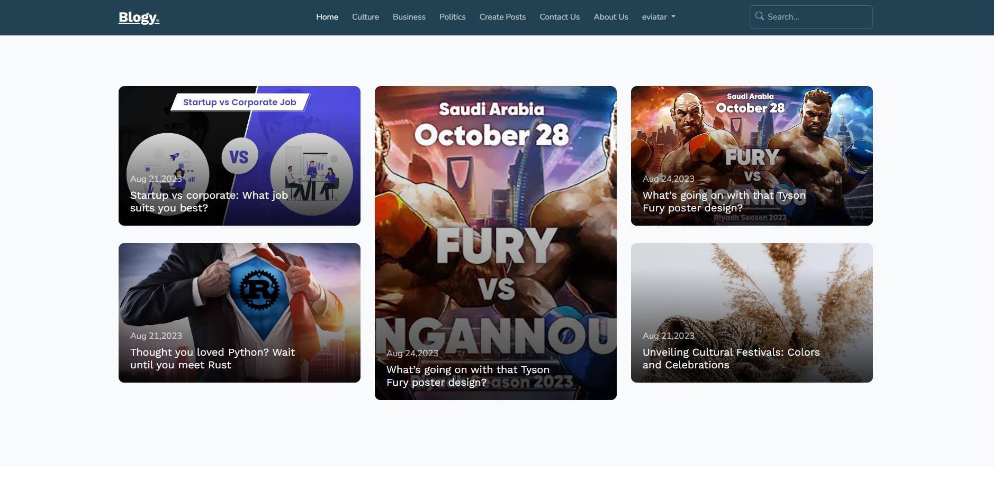
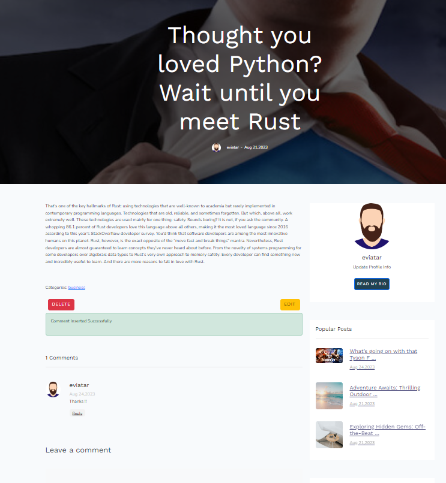
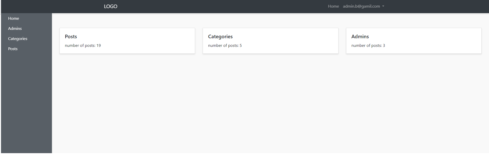

# Blogy - A Laravel Blogging Platform

Blogy is a web-based blogging platform developed using Laravel. It allows users to create, publish, and manage their blog posts, along with features like comments and an admin panel.

## Features

-   User-friendly interface for creating and managing blog posts.
-   Commenting system for users to engage in discussions.
-   Admin panel for easy management of posts and comments.
-   ...

## Screenshots

_Home Page_

_Culture Home Page_

_Create a New Post Page_

_Comment Section_

_Admin Panel_

## Contributing

Contributions are welcome! If you find any issues or would like to enhance the project, feel free to submit a pull request.
